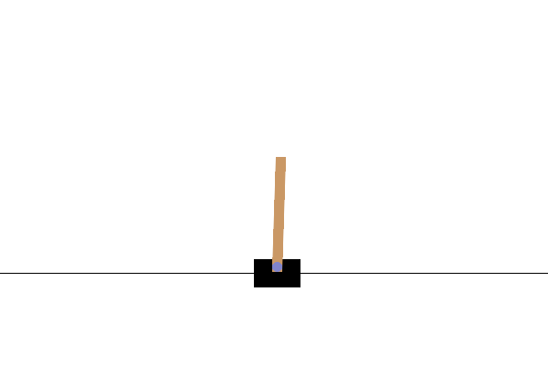
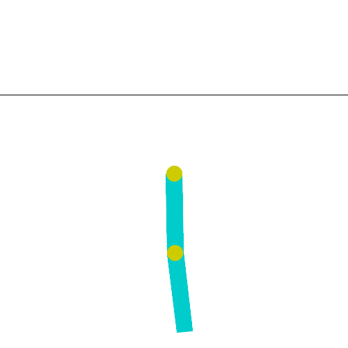
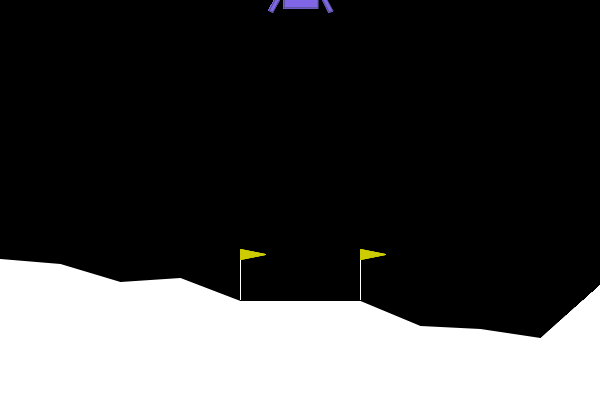
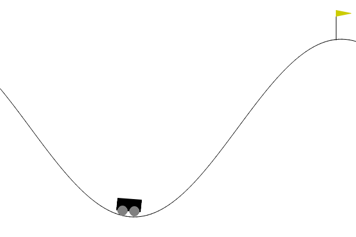
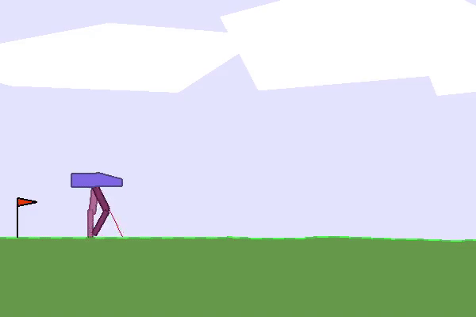

# PPO-Q: Proximal Policy Optimization with Parametrized Quantum Policies or Values

## Setup

### Requirements

- **Python 3.10** (tested `3.10.20` in `Paper_2`)
- **CUDA 13** optional (auto fallback to CPU)

### Option A — Conda (recommended, tested on `Paper_2`)

```bash
# 1. Create and activate env (Python 3.10.20)
conda create -n Paper_2 python=3.10.20 -y
conda activate Paper_2

# 2a. From environment.yml (minimal, reproducible)
conda env update -f environment.yml --prune

# 2b. Or install core deps manually
conda install -c conda-forge swig=4.4.1 pyyaml -y
pip install torch==2.12.0 torchvision==0.27.0 --index-url https://download.pytorch.org/whl/cu130  # CPU: --index-url https://download.pytorch.org/whl/cpu
pip install --editable ./third_party/torchquantum
pip install "quarkstudio==7.1.8" "qiskit==1.4.5" "qiskit-aer==0.13.3" "qiskit-ibm-runtime==0.20.0"
pip install "gymnasium[box2d]==0.29.1" box2d-py==2.3.5 pygame==2.6.1
pip install numpy==1.26.4 scipy==1.15.3 matplotlib==3.10.9 pyyaml==6.0.3 tqdm==4.67.3 tensorboard==2.20.0 imageio==2.37.3

# 3. Verify
python -c "import torch, torchquantum, qiskit, quarkstudio, gymnasium; print('OK', torch.__version__)"
```

> `environment.yml` in repo root is exported from the verified `Paper_2` env (`/home/trinhpt/miniconda3/envs/Paper_2`). Use `conda env create -f environment.yml` for exact reproduction.

### Option B — pip only (no conda)

```bash
# Python 3.10
pip install torch==2.12.0 torchvision==0.27.0 --index-url https://download.pytorch.org/whl/cu130  # CPU alternative: .../whl/cpu
pip install --editable ./third_party/torchquantum
pip install "quarkstudio==7.1.8" "qiskit==1.4.5" "qiskit-aer==0.13.3" "qiskit-ibm-runtime==0.20.0"
pip install "gymnasium[box2d]==0.29.1" box2d-py==2.3.5 pygame==2.6.1
pip install numpy==1.26.4 scipy==1.15.3 matplotlib==3.10.9 pyyaml==6.0.3 tqdm==4.67.3 tensorboard==2.20.0 imageio==2.37.3
# Optional (used in some configs/logs)
pip install pyscf==2.13.0 torchdiffeq==0.2.5
```

### Verify installation

```bash
python -c "import torchquantum; import quark; import qiskit; import gymnasium; print('All imports OK')"
python -c "from multiUAV_env import multiUAV; e=multiUAV(); print(e.observation_space.shape, e.action_space)"
tensorboard --logdir=./runs  # http://localhost:6006
```

### Tested versions (Paper_2)

| Package | Version | Notes |
|---------|---------|-------|
| python | 3.10.20 | required |
| torch | 2.12.0 | cu130 / cpu |
| torchvision | 0.27.0 |  |
| torchquantum | 0.1.8 | `--editable ./third_party/torchquantum` |
| quarkstudio | 7.1.8 | Quafu cloud (optional) |
| qiskit | 1.4.5 | + qiskit-aer 0.13.3 |
| gymnasium | 0.29.1 | + box2d-py 2.3.5, pygame 2.6.1, swig 4.4.1 |
| numpy | 1.26.4 |  |
| scipy | 1.15.3 |  |
| matplotlib | 3.10.9 |  |
| tensorboard | 2.20.0 | + tensorflow 2.21.0 |
| cuda-toolkit | 13.0.2 | optional, for GPU |
| pyyaml | 6.0.3 |  |
| tqdm | 4.67.3 |  |
| imageio | 2.37.3 | for GIF render |

## Usage

### Quick Start

```bash
# Single-agent PPO-Q (Gym / 1 UAV)
python main.py CartPole          # CartPole-v1
python main.py UAV               # 1-UAV environment
# Multi-agent MAPPO-Q (3 UAVs, quantum)
python main_mappo.py multiUAV_MAPPO
# Multi-agent baseline (classical MLP)
python main_mappo.py multiUAV_MAPPO_normal
# TensorBoard
tensorboard --logdir=./runs      # http://localhost:6006
```

### 1) Training — Single-Agent (`main.py`)

```bash
python main.py <config_file_name>
# e.g.
python main.py CartPole
python main.py Acrobot
python main.py LunarLander
python main.py BipedalWalker
python main.py MountainCar
python main.py Pendulum
python main.py UAV               # config/UAV.yaml → UAV_Environment (1 UAV, 250 users)
```
- `<config_file_name>` is a file in `config/` without `.yaml` (e.g. `CartPole` → `config/CartPole.yaml`).
- Create a custom YAML by copying an existing one and editing hyper-parameters below.
- Logs: `runs/env_{env}_{timestamp}/` (TensorBoard), Weights: `weights/env_{env}_{timestamp}/PPO_actor.pt` + `PPO_critic.pt`.

### 2) Training — Multi-Agent MAPPO (`main_mappo.py`, 3 UAVs)

```bash
python main_mappo.py multiUAV_MAPPO          # Quantum actor (default, use_quantum: true)
python main_mappo.py multiUAV_MAPPO_normal   # Classical MLP actor (use_quantum: false)
```
- Env: `multiUAV` (3 UAVs, `Discrete(125)=5^3` base-5, 250 users, 10×10 heatmap, `max_step=100`).
- Actor: 3 × `DiscreteActor` (quantum, `n_wires=4, n_blocks=2`) vs 3 × MLP `[64,64]` (normal).
- Critic: centralized `CentralizedCritic` on global obs `406` dims.
- Logs/weights: `runs/env_multiUAV_MAPPO_*` + `weights/env_multiUAV_MAPPO{Quantum|Normal}_*/MAPPO_actor.pt`.

### 3) Rendering — GIF & Trajectory

```bash
# Single-agent (loads latest weights/env_{name}_*/PPO_actor.pt)
python render.py CartPole
python render.py UAV             # → runs/UAV_render.gif + runs/UAV_trajectory.png (or ./runs/)

# Multi-agent (loads latest MAPPO* weights)
python multiuav_render.py multiUAV_MAPPO
python multiuav_render.py multiUAV_MAPPO_normal
# Output: runs/multiUAV_MAPPO_render.gif + runs/multiUAV_MAPPO_trajectory.png
```

### 4) Plotting — Reward Curves

```bash
# Compare latest MAPPO-Q vs MAPPO-normal on one chart
python plot_rewards.py --compare-mappoq --window 50 --output runs/mappo_vs_mappoq_compare.png

# Plot latest single + latest MAPPO
python plot_rewards.py --both --window 50

# Single / MAPPO only
python plot_rewards.py --single --window 50
python plot_rewards.py --mappo --window 50

# Explicit logdirs
python plot_rewards.py runs/env_multiUAV_MAPPO_Quantum_* runs/env_multiUAV_MAPPO_Normal_* --window 50 --output runs/compare.png
```

### 5) TensorBoard

```bash
tensorboard --logdir=./runs
# Tags: charts/episodic_return, charts/episodic_length, charts/avg_satisfied_users,
#       losses/actor_loss, losses/critic_loss, losses/entropy, losses/approx_kl, losses/clipfrac
```

#### Description of Configuration Parameters

| Parameter         | Description                                                  | Example Value    |
| ----------------- | ------------------------------------------------------------ | ---------------- |
| `env_name`        | Name of the reinforcement learning environment.              | `LunarLander-v2` |
| `n_steps`         | Number of steps per environment per update.                  | 1024             |
| `mini_batch_size` | Size of the mini-batch.                                      | 64               |
| `max_train_steps` | Maximum number of training steps.                            | 1,750,000        |
| `lr_a`            | Learning rate for the actor network.                         | 0.003            |
| `lr_c`            | Learning rate for the critic network.                        | 0.0003           |
| `gamma`           | Discount factor.                                             | 0.999            |
| `lamda`           | GAE parameter.                                               | 0.98             |
| `epsilon`         | PPO clip parameter.                                          | 0.2              |
| `K_epochs`        | Number of PPO epochs.                                        | 4                |
| `entropy_coef`    | Entropy coefficient.                                         | 0.01             |
| `num_envs`        | Number of environments to run in parallel.                   | 16               |
| `n_blocks`        | Number of blocks in the quantum reinforcement learning network. | 1                |
| `n_wires`         | Number of qubits in the quantum circuit.                     | 4                |
| `use_quafu`       | Specify whether to use Quafu quantum hardware                | True             |
| `key`             | Token required for accessing Quafu cloud quantum hardware    | ' '              |

Training results can be visualized using TensorBoard:

```bash
tensorboard --logdir=./runs
```

## Results

Benchmark reinforcement learning environments have been successfully solved using PPO-Q, as illustrated in the following table and figures.

|    Environment     | State Space Dimension | Action Space Dimension |
| :----------------: | :-------------------: | :--------------------: |
|    **CartPole**    |           4           |           2            |
|  **MountainCar**   |           2           |           3            |
|    **Acrobot**     |           6           |           3            |
|  **LunarLander**   |           8           |           4            |
| **MountainCar(C)** |           2           |           1            |
|    **Pendulum**    |           3           |           1            |
| **LunarLander(C)** |           8           |           2            |
| **BipedalWalker**  |          24           |           4            |

|            **CartPole**            |           **Acrobot**            |           **LunarLander**            |
|:----------------------------------:|:--------------------------------:|:------------------------------------:|
|  |  |  |

| **MountainCarC**       |          **Pendulum**           | **BipedalWalker**      |
|:----------------------:|:-------------------------------:|:----------------------:|
|  |   |  |

## Citation

```
arxiv is coming soon!
```


